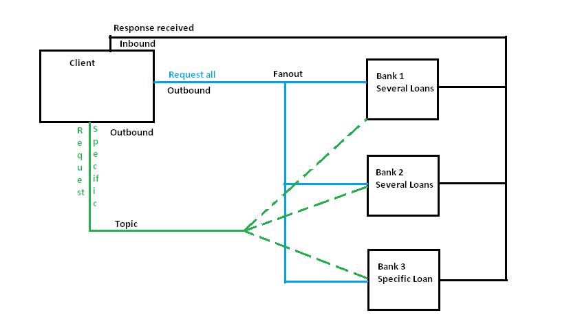

# Assignment Banking operations
This is an exercise rather than a studypoint assignment.

## Contributors
- _[Rúni Vedel Niclasen - cph-rn118](https://github.com/Runi-VN)_
- _[Camilla Jenny Valerius Staunstrup - cph-cs340](https://github.com/Castau)_

## Description

The customer application:  
- makes a loan requests to multiple banks;
- collects non-binding bank quotes from (simulated) bank applications;
- compares the quotes and selects one, based on its own financial status and
criteria

## Setup
1. Run RabbitMQ on your workstation `docker run -it --rm --name rabbitmq -p 5672:5672 -p 15672:15672 rabbitmq:3.9-management`
2. Run any amount of clients (1 is enough). Pass in args if you want.
3. Run any amount of banks (1-3 suggested). Pass in args if you want diverse answers.

## Overview

A simple overview of our initial understanding can be seen here:  

We decided to only implement RabbitMQ due to time constraints and for not having seen Apache Camel integrated with RabbitMQ yet in class.

An application lender should provide the following to the banks through the client:
- Loan topic (car OR house)
- Loan amount
- Loan time
- Credit score

The banks will then respond whether they are interested or not, and if so, their rates.

### Considerations
- We only want one bank application so as to not have repeat code. But we need to simulate differences between them or pass their thresholds in as arguments.
- Client goes directly to bank or do we place a server in the middle?
- Queue, Topic, both, something entirely else?
- Both services need to consume and produce. The client needs to act on consumed content received in the end. How?
- How long should the client wait for answer? From how many banks?
- Data conversion? Only byte[] allowed.

This spurred different implementations, mainly due to there being several strategies.
- One implementation that follows a RPC strategy as proposed in the `tutorial-six-java` seen in Resources below. It can be found on the [rabbitmq-six](https://github.com/Hold-Krykke-BA/System_Integration/tree/rabbitmq-six/RabbitMQ) branch. It has not been tested extensively. This was chosen because we wanted the client to queue the server, the server to respond, and the client to take action on the response(s). 
- One implementation that follows closer to our teachings which follows the `tutorial-five-java` and six seen in resources below.

We wanted to implement it with Spring support as well (using `@RabbitTemplate` and `@Service` + easier data conversion) but that must come for a later application.  
We tried to convert data using SerializationUtils and some frameworks but ended up doing it using simple comma-separated string values.

### The client
There is one client that requests several banks.  
The client can be found in [/Client](./Client).

### The banks (Consumers)
There are several banks that respond to the client.  
The bank can be found in [/Bank](./Bank).  

The banks should be loaded several times for simulating several banks and responses. 

## Resources
- https://www.rabbitmq.com/tutorials/tutorial-six-java.html
  - https://www.enterpriseintegrationpatterns.com/patterns/messaging/RequestReply.html
  - https://github.com/rabbitmq/rabbitmq-tutorials/blob/master/java/RPCClient.java
  - https://github.com/rabbitmq/rabbitmq-tutorials/blob/master/java/RPCServer.java
- https://www.rabbitmq.com/tutorials/tutorial-five-java.html
- https://github.com/datsoftlyngby/soft2021fall-SI/tree/main/code/P8-RabbitMQ
- https://datsoftlyngby.github.io/soft2021fall/SI/week-43/#7-asynchronous-communication-messaging-and-mom
